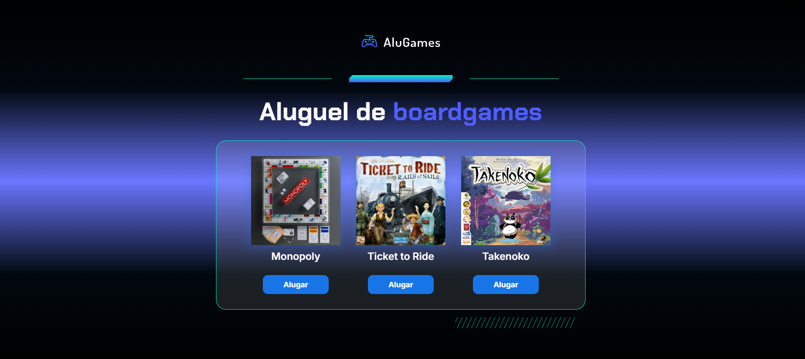
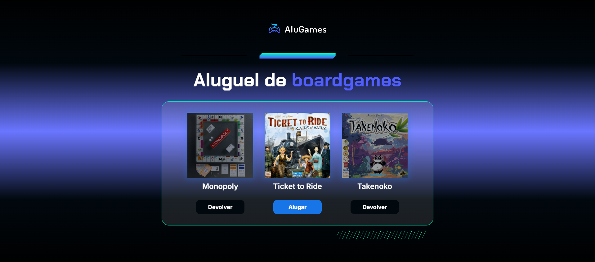
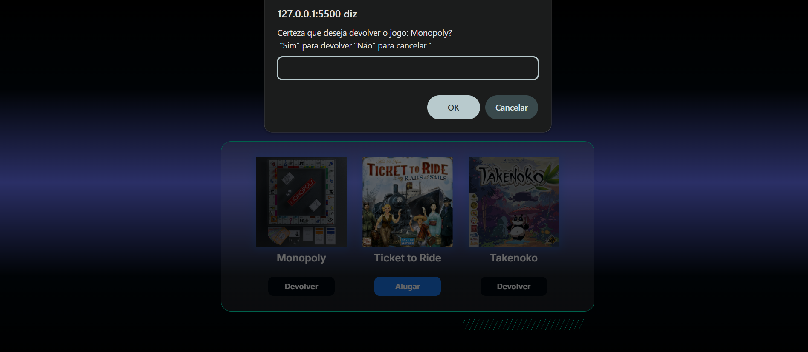

# 🧑🏽‍💻 Aplicações em Linguagem JavaScript - ALURA

Durante o curso de **Lógica para Programação com JavaScript** da Alura, foram propostos diversos desafios práticos para consolidar o conteúdo aprendido.  

Este repositório reúne todos os códigos desenvolvidos ao longo do curso.  

As aplicações desenvolvidas foram:  
- **AluGames** → Sistema de aluguel e devolução de jogos de tabuleiro.  
- **Sorteador de Amigo Secreto** → Sistema que realiza o sorteio automático de amigos secretos.  
- **Carrinho de Compras** → Sistema que registra a quantidade de produtos e o valor total de uma compra.  
- **Venda de Ingressos** → Sistema de controle e validação de vendas de ingressos.  
- **Sorteador de Números** → Sistema que gera números aleatórios dentro de um intervalo definido pelo usuário.  

---

## 🛠️ Tecnologias Utilizadas

---

## 📂 Estrutura do Repositório

- 📂 **Alugames/** → Arquivos do sistema de aluguel e devolução de jogos de tabuleiro.  
- 📂 **Amigo_Secreto/** → Arquivos do sistema de sorteio de amigo secreto.  
- 📂 **Carrinho_Compras/** → Arquivos do sistema de carrinho de compras.  
- 📂 **Ingresso/** → Arquivos do sistema de venda de ingressos.  
- 📂 **Sorteador_Numeros/** → Arquivos do sistema de sorteio de números.  

---

## ♟️ Aplicação 1: AluGames

Sistema de **locação e devolução de jogos de tabuleiro**, desenvolvido em **HTML, CSS e JavaScript**.  

  

  

  

---

## 🫂 Aplicação 2: Sorteador de Amigo Secreto

Sistema de **sorteio de amigo secreto**, no qual os nomes são inseridos e o programa sorteia os pares automaticamente.  

*(Imagens da aplicação podem ser adicionadas aqui futuramente)*

---

## 🛒 Aplicação 3: Carrinho de Compras

Sistema de **carrinho de compras**, responsável por calcular o número de itens e o valor total da compra.  

*(Imagens da aplicação podem ser adicionadas aqui futuramente)*

---

## 🎟️ Aplicação 4: Venda de Ingressos

Sistema de **controle de vendas de ingressos**, permitindo registrar e validar a compra de entradas para eventos.  

*(Imagens da aplicação podem ser adicionadas aqui futuramente)*

---

## 🔢 Aplicação 5: Sorteador de Números

Sistema de **sorteio de números**, que gera valores aleatórios dentro de um intervalo informado pelo usuário.  

*(Imagens da aplicação podem ser adicionadas aqui futuramente)*

---

## 📌 Considerações Finais

Desenvolver essas aplicações foi um exercício fundamental para **fixar conceitos de lógica de programação e JavaScript**.  
Cada projeto, apesar de simples, traz uma **base sólida** para aplicações mais complexas no futuro.  

Se tiver sugestões de melhorias ou quiser contribuir, fique à vontade para abrir uma **issue** ou enviar um **pull request**.  

✨ *Obrigado por visitar este repositório!* 🚀
