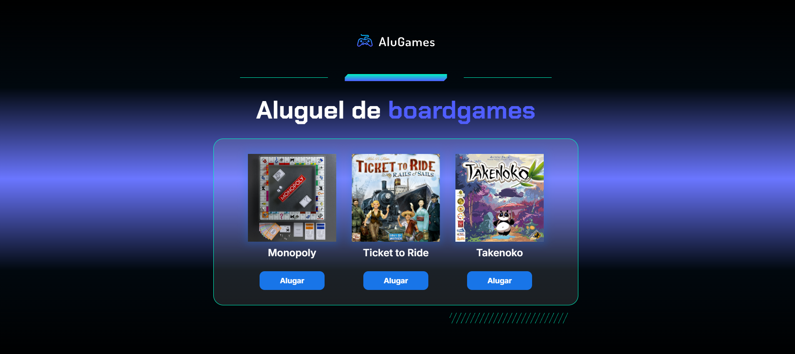
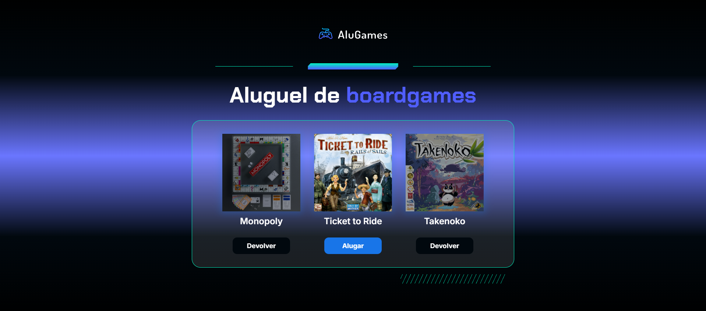
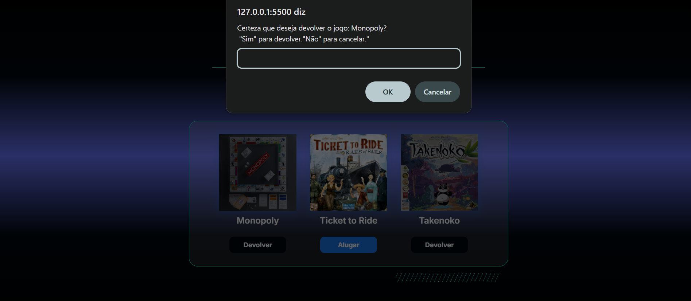
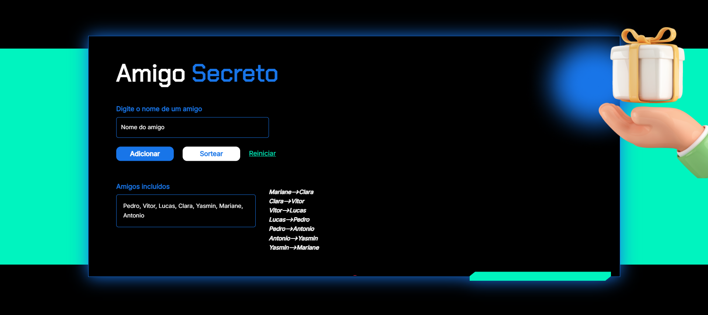
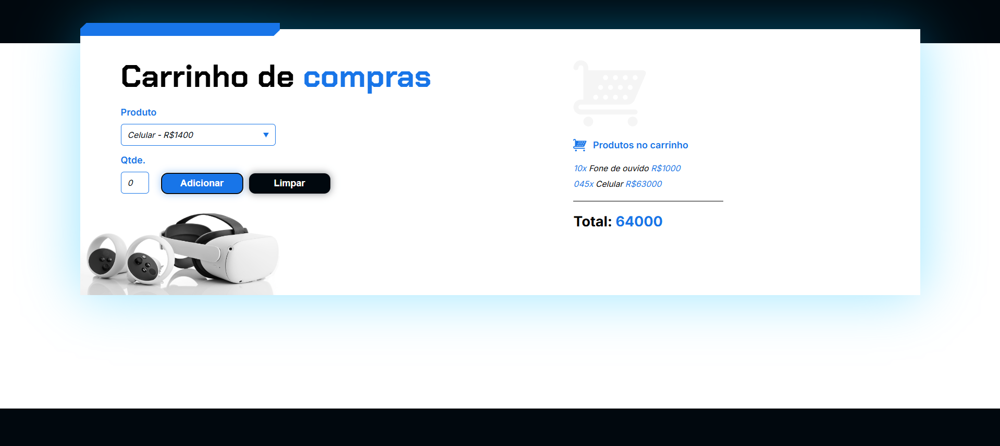
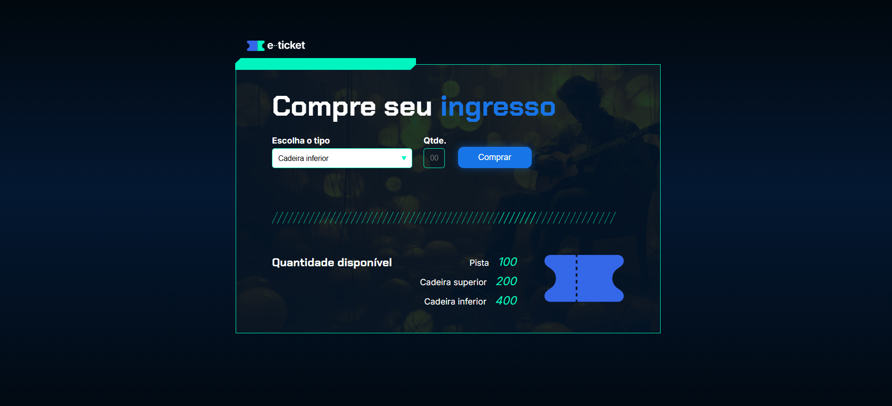
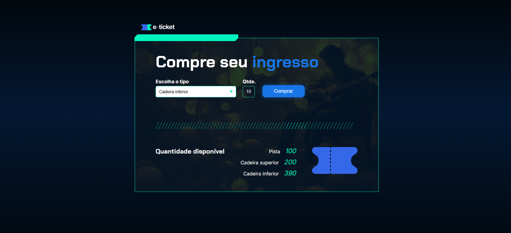
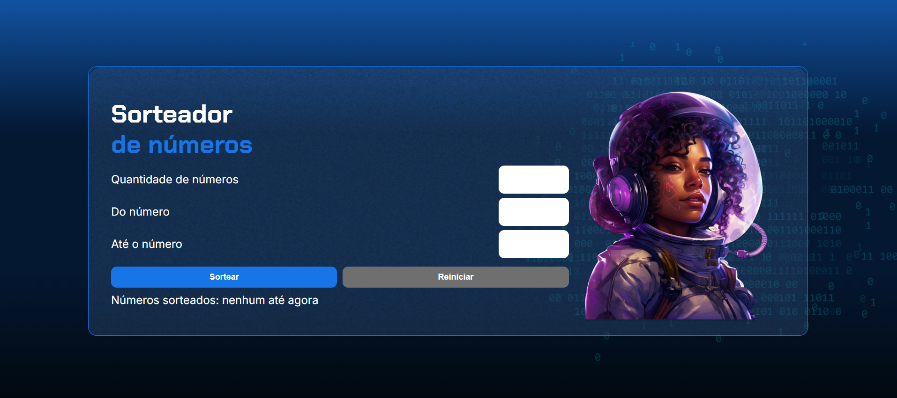
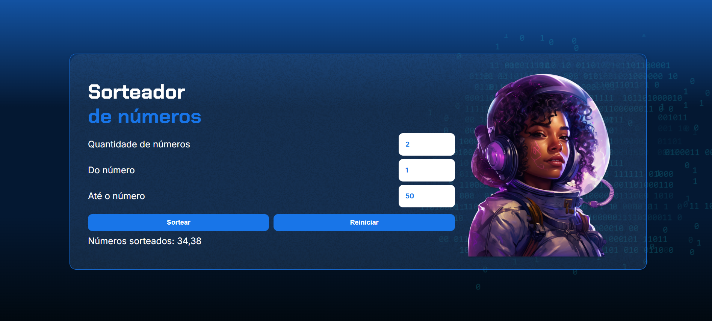

# 🧑🏽‍💻 JavaScript Applications - ALURA

During Alura's **Programming Logic with JavaScript** course, several practical challenges were proposed to reinforce the concepts learned.

This repository gathers all the code developed throughout the course.

The applications developed were:
- **AluGames** → Board game rental and return management system.
- **Secret Santa Draw** → System that automatically performs Secret Santa pairings.
- **Shopping Cart** → System that records product quantities and calculates the total purchase value.
- **Ticket Sales** → Ticket sales control and validation system.
- **Number Generator** → System that generates random numbers within a user-defined range.

---

## 🛠️ Technologies Used

---

## 📂 Repository Structure

- 📂 **Alugames/** → Files for the board game rental and return system.
- 📂 **Amigo_Secreto/** → Files for the Secret Santa draw system.
- 📂 **Carrinho_Compras/** → Files for the shopping cart system.
- 📂 **Ingresso/** → Files for the ticket sales system.
- 📂 **Sorteador_Numeros/** → Files for the random number generator system.

---

## ♟️ Application 1: AluGames

A **board game rental and return system**, developed using **HTML, CSS, and JavaScript**.

  

  

  

---

## 🫂 Application 2: Secret Santa Draw

A **Secret Santa drawing system**, where names are entered and the program automatically generates the pairings.

  

  

---

## 🛒 Application 3: Shopping Cart

A **shopping cart system**, responsible for calculating the number of items and the total purchase value.

  

  

---

## 🎟️ Application 4: Ticket Sales

A **ticket sales management system**, allowing users to register and validate ticket purchases for events.

  

  

  

---

## 🔢 Application 5: Number Generator

A **random number generator system** that produces values within a range specified by the user.

  

  

---

## 📌 Final Remarks

Developing these applications was an essential exercise for strengthening **programming logic and JavaScript concepts**.

Although simple, each project provides a **solid foundation** for building more complex applications in the future.

If you have suggestions for improvements or would like to contribute, feel free to open an **issue** or submit a **pull request**.

✨ *Thank you for visiting this repository!* 🚀
